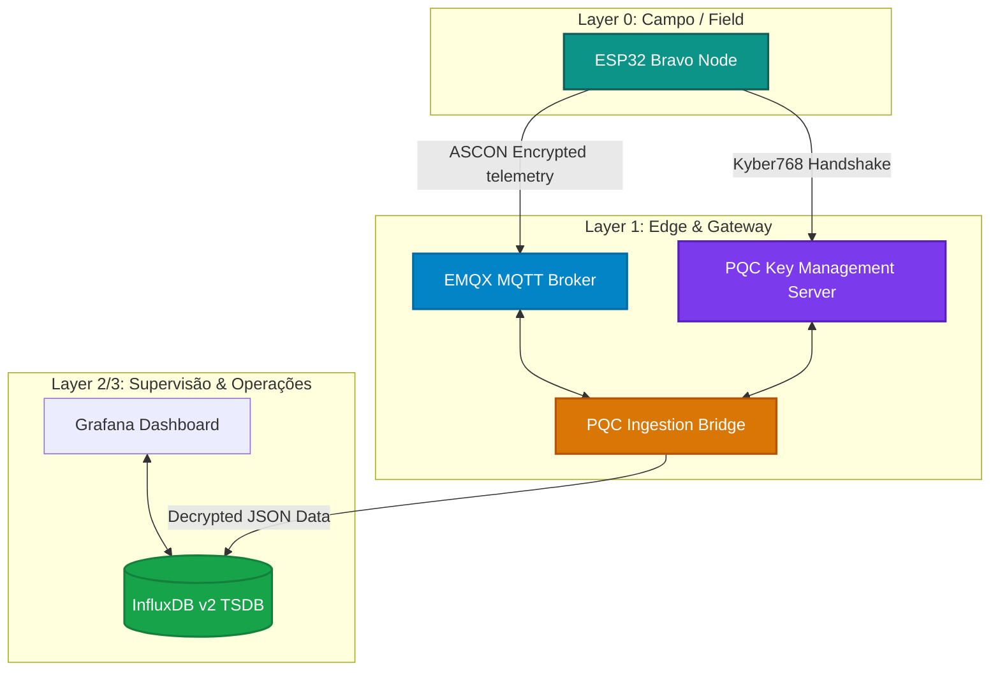

# MSI-TESE: Realistic IIoT-Driven ICS Testbed
## Post-Quantum Security (PQC) & Lightweight Cryptography (LWC)

Este repositório contém a implementação prática e experimental desenvolvida no âmbito da dissertação de mestrado **"Realistic IIoT-Driven ICS Testbed..."**. 

O objetivo do projeto é demonstrar a viabilidade, performance e segurança de uma arquitetura de **Defesa em Profundidade** para redes industriais (ICS / IIoT), integrando algoritmos de **Criptografia Pós-Quântica (PQC)** na camada Edge/Gateway e de **Criptografia Leve (LWC)** na camada de campo (microcontroladores de recursos restritos).

---

## 📐 Arquitetura do Sistema (Modelo ISA-95)

A arquitetura do testbed foi desenhada em estrita conformidade com a Pirâmide de Automação Industrial (**ISA-95**):

---

## 🧪 Fases Experimentais

O testbed replica a mesma arquitetura em fases físicas separadas (uma VLAN cada) que diferem **apenas na postura criptográfica**, para isolar o custo de cada camada de segurança:

| Fase | VLAN | Criptografia | Estado |
|---|---|---|---|
| **Alpha** | 100 | Nenhuma (plaintext, baseline) | ✅ ativa |
| **Bravo** | 20 | Kyber768 + Dilithium3 + ASCON-128 (**PQC/LWC**) | ✅ ativa |
| **Charlie** | 30 | ECDH-P384 + ECDSA-P384 + HKDF-SHA256 + AES-128-GCM (**clássica**, grupo de controlo; chave ECDSA nativa em **TPM 2.0**) | ✅ ativa (2026-07-12) |
| **Delta** | 40 | Gémeo digital (virtual) | 🔜 planeada |

**Lógica:** Alpha→Charlie mede o custo de *ter* criptografia; **Charlie→Bravo mede o custo de ser *pós-quântico* vs clássico** .. O plano e as ferramentas de comparação 24 h estão em [`Configurations/analysis/`](Configurations/analysis/).

---

## 🗂️ Organização dos Ficheiros (Por Equipamento Físico & Serviço)

Para facilitar a navegação académica e a replicação experimental do testbed, os ficheiros estão estruturados com base no seu papel físico e camada lógica no sistema:

### 1. Camada de Campo (Field Layer / Layer 0)
*   **[`/Layer0-Field-ESP32`](file:///c:/viper5000/git/MSI-TESE-main/Layer0-Field-ESP32/)**: Contém os firmwares concebidos para os microcontroladores de campo ESP32.
    *   **[`/Bravo-Secure`](file:///c:/viper5000/git/MSI-TESE-main/Layer0-Field-ESP32/Bravo-Secure/)**: Firmware seguro que executa o handshake Kyber768 por HTTP, realiza a rotação de chaves baseada nas normas do NIST SP 800-57, encripta os dados dos sensores com o algoritmo leve **ASCON-128** e publica no broker via MQTT.
    *   **`/Charlie-KineticNode`, `/Charlie-Relay`, `/Charlie-TempSensor`**: Firmware da Fase Charlie (controlo clássico) — handshake **ECDH secp384r1** + HKDF-SHA256 por HTTP e cifra de campo **AES-128-GCM** via mbedTLS acelerado por hardware (`ecdh_kex.h` + `aes_gcm_wrapper.h`). O KineticNode está em produção; Relay e TempSensor por gravar.
    *   **[`/Legacy-Alpha`](file:///c:/viper5000/git/MSI-TESE-main/Layer0-Field-ESP32/Legacy-Alpha/)**: Firmware legado (Fase Alpha) que transmite dados em *plaintext*, servindo de base de comparação (baseline) para avaliar o impacto do overhead de latência e processamento do PQC/LWC.

### 2. Camada Edge & Serviços (Edge & Gateway Layer / Layer 1)
*   **[`/Layer1-Edge-PQC-Server`](file:///c:/viper5000/git/MSI-TESE-main/Layer1-Edge-PQC-Server/)**: Servidor central de gestão de chaves quânticas.
    *   Desenvolvido em **FastAPI** (Python) e suportado pelo **`liboqs-python`** (Open Quantum Safe).
    *   Gera em memória os pares de chaves **Kyber768** (KEM) e **Dilithium3** (Assinaturas Digitais).
    *   **[`/templates/dashboard.html`](file:///c:/viper5000/git/MSI-TESE-main/Layer1-Edge-PQC-Server/templates/dashboard.html)**: Painel Web de monitorização futurista (*glassmorphism*) que exibe gráficos de handshakes, idade da chave ativa, logs do terminal em tempo real e permite forçar a rotação de chaves com um clique.

*   **[`/Layer1-Edge-Docker-Stack`](file:///c:/viper5000/git/MSI-TESE-main/Layer1-Edge-Docker-Stack/)**: Contentores Docker responsáveis pela receção, decifração e persistência.
    *   **EMQX Broker (v5.5.0):** Roteador de mensagens MQTT de alta performance e baixa latência.
    *   **InfluxDB v2:** Base de dados de séries temporais para guardar as telemetrias.
    *   **Grafana:** Renderização visual e estatística das métricas dos sensores de campo.
    *   **[`/bridge`](file:///c:/viper5000/git/MSI-TESE-main/Layer1-Edge-Docker-Stack/bridge/)**: Gateway inteligente que subscreve ao EMQX, solicita a chave simétrica ativa ao Servidor PQC, decifra os payloads ASCON-128 e armazena os valores em plaintext no InfluxDB.

*   **`/Layer1-Edge-Classical-Server`**: Contraparte **clássica** da Fase Charlie (servidor de chaves + serviços edge/SCADA). Servidor **FastAPI** com a biblioteca `cryptography` (ECDH/ECDSA secp384r1, sem liboqs), com **chave de assinatura ECDSA nativa em TPM 2.0** (`tpm_ecc.py`), a bridge `bridge_charlie.py` (AES-128-GCM), o display e-Paper `epd_scada.py` e o provisionamento do Node-RED/Grafana em `scada-c/`. Corre nativamente via systemd (sem Docker), espelhando a arquitetura do Bravo.

*   **`/Configurations/analysis`**: Plano e ferramentas da comparação de métricas 24 h entre as três fases — `extract_24h.py` (extração + deltas), `healthcheck.sh`, e o README metodológico.

---

## 🔐 Primitivas Criptográficas Utilizadas

| Algoritmo | Tipo / Camada | Norma / Padrão | Objetivo do Projeto |
| :--- | :--- | :--- | :--- |
| **Kyber768** | PQC (Key Encapsulation) | NIST FIPS 203 | Estabelecer um segredo simétrico de 256 bits seguro contra computação quântica. |
| **Dilithium3** | PQC (Digital Signature) | NIST FIPS 204 | Assinar e verificar comandos críticos do SCADA/PLC para os atuadores de campo. |
| **ASCON-128** | LWC (Symmetric AEAD) | NIST LWC Standard | Cifrar a telemetria industrial nos microcontroladores restritos (ESP32) com alta velocidade. |

---

## 🛡️ Mecanismo de Autocura de Chaves (Self-Healing)

Para evitar quedas na receção de telemetria durante a rotação periódica de chaves (a cada 1 hora ou quando o administrador clica no Dashboard):
1. A **PQC Ingestion Bridge** deteta falhas no parsing de dados cifrados.
2. Efetua um pedido em background ao Servidor PQC recolhendo a chave simétrica ativa mais recente.
3. Decifra o pacote pendente e continua a ingestão no InfluxDB de forma totalmente transparente e automática.

---

## 📈 Relevância Científica para a Dissertação
A separação estrutural e a telemetria comparativa coletada pelas tres fases (**Alpha** / **Bravo** / **Charlie**) deste testbed fornecem as métricas reais:
*   **Latência de Handshake:** Medição do tempo de processamento do Kyber768 no ESP32.
*   **Overhead do LWC:** Tempo em microsegundos do ASCON-128 vs Cifragem Simétrica convencional.
*   **Consumo de Memória:** Impacto do parser JSON e das primitivas OQS em microcontroladores.
